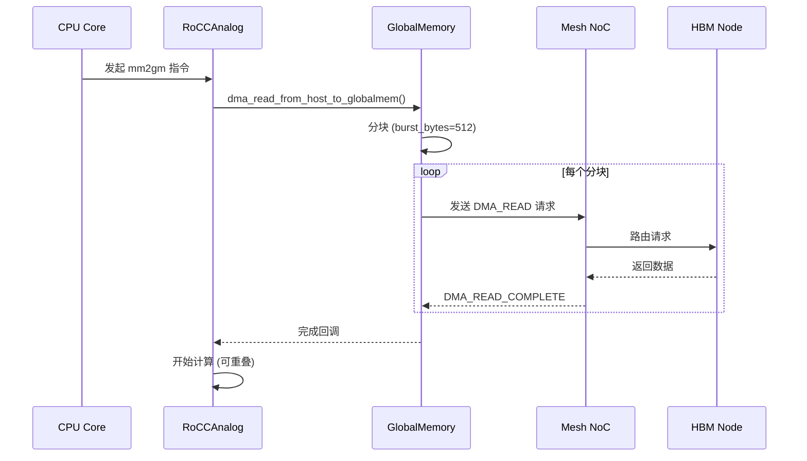
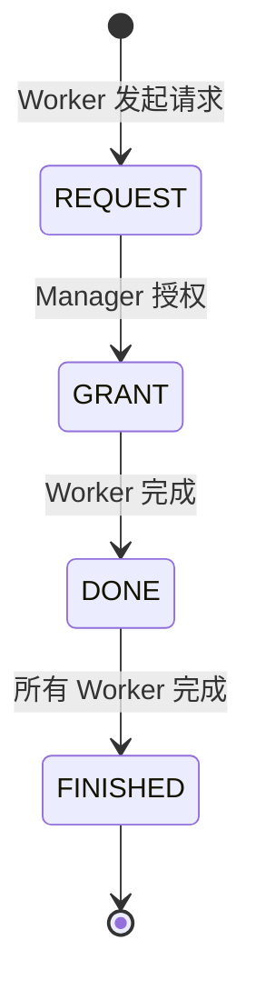
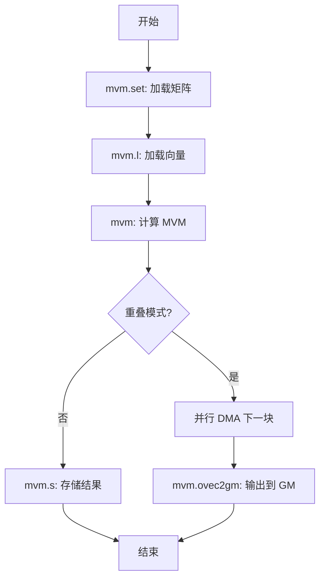
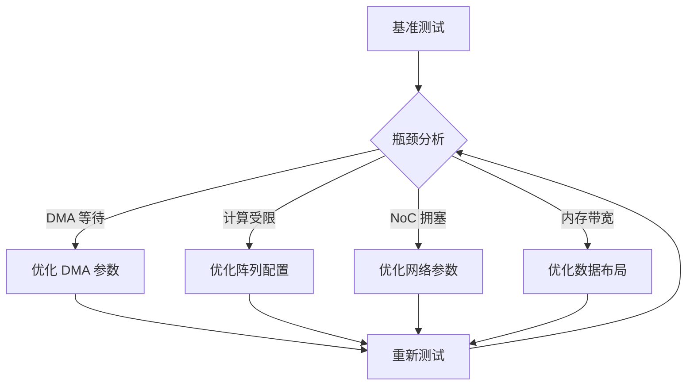

# Golem 多核架构与 DMA 机制分析报告

## 目录
- [1. 架构概览](#1-架构概览)
- [2. 配置文件体系](#2-配置文件体系)
- [3. DMA 机制深度分析](#3-dma-机制深度分析)
- [4. GroupCtrl 控制机制](#4-groupctrl-控制机制)
- [5. RoCCAnalog 计算接口](#5-roccanalog-计算接口)
- [6. NoC 网络架构](#6-noc-网络架构)
- [7. 性能优化建议](#7-性能优化建议)
- [8. 常见问题与解决方案](#8-常见问题与解决方案)
- [9. 性能调优流程](#9-性能调优流程)
- [10. 监控指标](#10-监控指标)

## 1. 架构概览

### 1.1 系统组成

Golem 是一个基于 SST (Structural Simulation Toolkit) 的多核计算架构，主要用于模拟和优化矩阵-向量乘法 (MVM) 和通用矩阵乘法 (GEMM) 工作负载。系统由以下核心组件构成：

```
┌─────────────────────────────────────────────────────────────────┐
│                        Golem 多核架构                            │
├─────────────────────────────────────────────────────────────────┤
│  ┌─────────┐  ┌─────────┐  ┌─────────┐  ┌─────────┐            │
│  │ Core 0  │  │ Core 1  │  │ Core 2  │  │ Core 3  │  CPU 行    │
│  │ RoCC    │  │ RoCC    │  │ RoCC    │  │ RoCC    │            │
│  │ GM      │  │ GM      │  │ GM      │  │ GM      │            │
│  └────┬────┘  └────┬────┘  └────┬────┘  └────┬────┘            │
│       │            │            │            │                   │
│  ┌────▼────────────▼────────────▼────────────▼────┐             │
│  │              Mesh NoC (4×N)                    │             │
│  │  链路带宽: 25-100GB/s  Flit: 128B             │             │
│  └────┬────────────┬────────────┬────────────┬────┘             │
│       │            │            │            │                   │
│  ┌────▼────┐  ┌───▼────┐  ┌───▼────┐  ┌───▼────┐              │
│  │ HBM 1   │  │ HBM 2  │  │ HBM 3  │  │ HBM 4  │  数据内存行  │
│  │ Node 1  │  │ Node 2 │  │ Node 3 │  │ Node 4 │              │
│  └─────────┘  └────────┘  └────────┘  └────────┘              │
│                                                                  │
│  ┌─────────┐                                                    │
│  │ OS Mem  │  OS 内存行 (Node 0)                               │
│  │ Node 0  │                                                    │
│  └─────────┘                                                    │
└─────────────────────────────────────────────────────────────────┘
```

### 1.2 核心参数

| 参数 | 默认值 | 说明 |
|------|--------|------|
| `GOLEM_DIM` | 64 | 矩阵/向量维度 |
| `GOLEM_TOTAL_CORES` | 20 | 总核心数 |
| `GOLEM_TOTAL_GEMM_CORES` | 20 | GEMM 并发核心数 |
| `GOLEM_NUM_MEMORY_NODES` | 5 | 内存节点总数 (1 OS + 4 数据) |
| `GOLEM_MESH_DIM_X` | 4 | Mesh 网络列数 |
| `GOLEM_GLOBAL_STRIDE_KB` | 256 | 每核 GM 窗口大小 |

## 2. 配置文件体系

### 2.1 配置文件结构

Golem 采用分层配置文件系统，通过 [`run_noc_dma_pipeline.sh`](pkg/sst-elements/src/sst/elements/golem/tests/run_noc_dma_pipeline.sh:1) 自动加载：

```
configs/
├── default.env          # 主配置文件（自动加载）
├── 10_core_gemm.env     # 核心/GEMM 参数
├── 20_dma.env           # DMA/流水重叠参数
├── 30_network.env       # 网络/拓扑参数
├── 40_debug_io.env      # 调试/IO 参数
├── 50_tensor_verify.env # 张量校验参数
└── 60_run.env           # 运行链路配置
```

### 2.2 配置加载优先级

```
命令行参数 > 环境变量 > 配置文件默认值
```

### 2.3 配置文件详解

#### 2.3.1 [`10_core_gemm.env`](pkg/sst-elements/src/sst/elements/golem/tests/configs/10_core_gemm.env:1) - 核心/GEMM 参数

| 参数 | 默认值 | 说明 |
|------|--------|------|
| `GOLEM_DIM` | 64 | 矩阵维度 |
| `GOLEM_TOTAL_GROUPS` | 4 | 组数量 |
| `GOLEM_ARRAY_DIM` | 64 | RoCC 阵列维度 |
| `GOLEM_NUM_ARRAYS` | 4 | RoCC 阵列实例数 |
| `GOLEM_TOTAL_CORES` | 20 | 总核心数 |
| `GOLEM_GEMM_M` | 512 | GEMM M 维 |
| `GOLEM_GEMM_N` | 16 | GEMM N 维 |
| `GOLEM_GEMM_K` | 512 | GEMM K 维 |
| `GOLEM_GEMM_BLOCK_M` | 64 | GEMM block_M |
| `GOLEM_GEMM_BLOCK_N` | 4 | GEMM block_N |
| `GOLEM_GEMM_BLOCK_K` | 64 | GEMM block_K |

**Phase-1 约束**:
- `GOLEM_GEMM_BLOCK_M == GOLEM_DIM`
- `GOLEM_GEMM_BLOCK_K == GOLEM_DIM`
- `GOLEM_GEMM_BLOCK_N <= GOLEM_DIM`

#### 2.3.2 [`20_dma.env`](pkg/sst-elements/src/sst/elements/golem/tests/configs/20_dma.env:1) - DMA/流水重叠参数

| 参数 | 默认值 | 说明 |
|------|--------|------|
| `GOLEM_DMA_STAGGER_CYCLES` | 0 | 每核 DMA 启动错峰周期 |
| `GOLEM_DMA_OVERLAP` | 0 | DMA/计算重叠开关 |
| `GOLEM_CTRL_OVERLAP_AB` | 1 | 控制 A/B 矩阵重叠 |
| `GOLEM_DMA_MAX_INFLIGHT` | 8 | 每核 DMA 最大在途请求数 |
| `GOLEM_DMA_READ_RETRY_TICKS` | 32 | DMA 读重试超时周期 |
| `GOLEM_DMA_READ_MAX_RETRIES` | 8 | DMA 读最大重试次数 |
| `GOLEM_DMA_BURST_BYTES` | 512 | DMA 分块大小 |
| `GOLEM_GLOBAL_STRIDE_KB` | 256 | 每核 GM 窗口大小 |

#### 2.3.3 [`30_network.env`](pkg/sst-elements/src/sst/elements/golem/tests/configs/30_network.env:1) - 网络/拓扑参数

| 参数 | 默认值 | 说明 |
|------|--------|------|
| `GOLEM_NUM_MEMORY_NODES` | 5 | 内存节点总数 |
| `GOLEM_MEM_NODE_SIZE_BYTES` | 134217728 | 每内存节点大小 (128MB) |
| `GOLEM_MESH_DIM_X` | 4 | Mesh 网络列数 |
| `GOLEM_NOC_INPUT_BUF_SIZE` | 64KB | NoC 输入缓冲区 |
| `GOLEM_NOC_OUTPUT_BUF_SIZE` | 64KB | NoC 输出缓冲区 |
| `GOLEM_NOC_LINK_BW` | 100GB/s | NoC 链路带宽 |
| `GOLEM_NOC_XBAR_BW` | 100GB/s | NoC 交叉开关带宽 |
| `GOLEM_NOC_FLIT_SIZE` | 128B | NoC flit 大小 |
| `GOLEM_GM_BUFFER_LENGTH` | 64KB | GlobalMemory 缓冲区 |
| `GOLEM_GROUP_MAX_INFLIGHT_PER_NODE` | 4 | 每节点最大在途请求数 |
| `GOLEM_GROUP_GRANT_WINDOW` | 1 | 组授权窗口大小 |

#### 2.3.4 [`40_debug_io.env`](pkg/sst-elements/src/sst/elements/golem/tests/configs/40_debug_io.env:1) - 调试/IO 参数

| 参数 | 默认值 | 说明 |
|------|--------|------|
| `GOLEM_ROCC_TYPE` | golem.RoCCAnalogInt | RoCC 类型 |
| `GOLEM_ARRAY_TYPE` | golem.MVMIntArray | 阵列类型 |
| `GOLEM_ROCC_VERBOSE` | 10 | RoCC 日志级别 |
| `GOLEM_GM_VERBOSE` | 10 | GlobalMemory 日志级别 |
| `GOLEM_MVM_DUMP_ENABLE` | 0 | MVM 结果转储开关 |
| `GOLEM_PROGRESS_HEARTBEAT` | 1 | 进度心跳开关 |
| `GOLEM_PROGRESS_INTERVAL_CYCLES` | 50000 | 进度心跳周期 |

#### 2.3.5 [`50_tensor_verify.env`](pkg/sst-elements/src/sst/elements/golem/tests/configs/50_tensor_verify.env:1) - 张量校验参数

| 参数 | 默认值 | 说明 |
|------|--------|------|
| `GOLEM_TENSOR_SOURCE` | sample | 输入来源 (synthetic/sample/file) |
| `GOLEM_TENSOR_DIR` | ${PWD}/data | 张量目录 |
| `GOLEM_VERIFY_C` | 1 | 端到端 C=AxB 校验 |

#### 2.3.6 [`60_run.env`](pkg/sst-elements/src/sst/elements/golem/tests/configs/60_run.env:1) - 运行链路配置

| 参数 | 默认值 | 说明 |
|------|--------|------|
| `GOLEM_CTRL_LINK_ENABLE` | 1 | 控制链路使能 |
| `GOLEM_REQUEST_SCHEDULER_ENABLE` | 1 | 请求调度器使能 |
| `GOLEM_GROUP_MANAGER_ENABLE` | 1 | 组管理器使能 |
| `GOLEM_CTRL_OVERLAP_AB` | 1 | 控制 A/B 重叠 |
| `GOLEM_GROUP_MAX_GRANTS_PER_SCHEDULE` | 1 | 每次调度最大授权数 |
| `GOLEM_ARCH_SCRIPT` | architecture/ncores_selfcom_dma_ctrl.py | 架构脚本 |
| `GOLEM_MATMUL_DTYPE` | fp32 | 矩阵乘法数据类型 |

### 2.4 配置使用示例

```bash
# 使用默认配置
./run_noc_dma_pipeline.sh

# 覆盖特定参数
./run_noc_dma_pipeline.sh --dim 128 --dma-overlap 1

# 使用自定义配置文件
source configs/10_core_gemm.env
./run_noc_dma_pipeline.sh
```

## 3. DMA 机制深度分析

### 3.1 DMA 架构

Golem 的 DMA 机制通过 [`GlobalMemory`](pkg/sst-elements/src/sst/elements/golem/globalmemory/globalmemory.h:130) 组件实现，支持两种主要模式：

#### 3.1.1 DMA 模式对比

| 特性 | DMA_OVERLAP=0 | DMA_OVERLAP=1 |
|------|---------------|----------------|
| 执行方式 | 串行：先 DMA 后计算 | 并行：DMA 与计算重叠 |
| 内存访问 | 阶段性访问 | 流水线访问 |
| 适用场景 | 小规模矩阵 | 大规模矩阵 (dim≥16) |
| 复杂度 | 低 | 高 |

#### 3.1.2 DMA 关键参数

```cpp
// DMA 重试机制参数
dma_read_retry_ticks = 96;        // 每次重试超时周期
dma_read_max_retries = 8;         // 最大重试次数
dma_read_max_inflight = 8;        // 每核最大在途请求数
dma_burst_bytes = 512;            // DMA 分块大小
```

### 3.2 DMA 操作流程



### 3.3 DMA 地址映射

```cpp
// 物理地址到内存节点的映射
uint8_t GlobalMemoryImplement::getDmaTargetNode(uint64_t phys_addr) {
    // 将物理地址按 memNodeSize 分段
    // 例如: memNodeSize = 64MB
    // addr 0x00000000-0x03FFFFFF -> Node 0 (OS)
    // addr 0x04000000-0x07FFFFFF -> Node 1 (Data)
    // addr 0x08000000-0x0BFFFFFF -> Node 2 (Data)
    // ...
    return static_cast<uint8_t>(phys_addr / memNodeSize);
}
```

## 4. GroupCtrl 控制机制

### 4.1 GroupCtrl 架构

[`GroupCtrlEndpoint`](pkg/sst-elements/src/sst/elements/golem/groupctrl/groupctrl.h:83) 实现了组内协调机制，用于管理多个 Worker 核心对共享内存节点的访问。

```
┌─────────────────────────────────────────────────────────────┐
│                    GroupCtrl 架构                           │
├─────────────────────────────────────────────────────────────┤
│                                                             │
│   Manager Core (Group Leader)                               │
│   ┌─────────────────────────────────────────────┐           │
│   │  Pending Queue (depth=32)                   │           │
│   │  ┌─────┐ ┌─────┐ ┌─────┐ ┌─────┐           │           │
│   │  │Req 0│ │Req 1│ │Req 2│ │Req 3│ ...       │           │
│   │  └──┬──┘ └──┬──┘ └──┬──┘ └──┬──┘           │           │
│   └─────┼───────┼───────┼───────┼────────────────┘           │
│         │       │       │       │                            │
│   ┌─────▼───────▼───────▼───────▼─────┐                     │
│   │     Scheduler (Round-Robin)       │                     │
│   │  max_grants_per_schedule = 1     │                     │
│   └─────┬───────┬───────┬───────┬─────┘                     │
│         │       │       │       │                            │
│   ┌─────▼───┐ ┌─▼────┐ ┌─▼────┐ ┌─▼────┐                   │
│   │Worker 0 │ │Wkr 1 │ │Wkr 2 │ │Wkr 3 │  Worker Cores      │
│   │Slot 0   │ │Slot 1│ │Slot 2│ │Slot 3│                   │
│   └─────────┘ └──────┘ └──────┘ └──────┘                   │
│                                                             │
│   消息类型: REQUEST -> GRANT -> DONE -> FINISHED           │
└─────────────────────────────────────────────────────────────┘
```

### 4.2 GroupCtrl 参数

| 参数 | 默认值 | 说明 |
|------|--------|------|
| `GOLEM_GROUP_MANAGER_ENABLE` | 1 | 启用组管理器 |
| `GOLEM_GROUP_MAX_INFLIGHT_PER_NODE` | 2 | 每内存节点最大在途请求数 |
| `GOLEM_GROUP_GRANT_WINDOW` | 1 | 授权窗口大小 |
| `GOLEM_GROUP_MAX_GRANTS_PER_SCHEDULE` | 1 | 每次调度最大授权数 |

### 4.3 GroupCtrl 消息流



## 5. RoCCAnalog 计算接口

### 5.1 RoCC 指令集

| func7 | 指令 | 功能 | 延迟 (cycles) |
|-------|------|------|---------------|
| 0x1 | mvm.set | 设置矩阵 | 10 |
| 0x2 | mvm.l | 加载向量 | 15 |
| 0x3 | mvm | 计算 MVM | 可变 |
| 0x4 | mvm.s | 存储向量 | 20 |
| 0x5 | mvm.mv | 移动向量 | 1 |
| 0x6 | mvm.ovec2gm | 输出向量→GM | 10 |
| 0x7 | mvm.gm2ivec | GM→输入向量 | 15 |
| 0x8 | mvm.gm2imat | GM→输入矩阵 | 20 |
| 0x9 | remote_st | 远程存储 | 20 |
| 0xA | remote_ld | 远程加载 | 25 |
| 0xD | mm2gm | 主存→GM | 可变 |
| 0xE | gm2mm | GM→主存 | 可变 |

### 5.2 计算流程



## 6. NoC 网络架构

### 6.1 Mesh 拓扑

```
     列 0   列 1   列 2   列 3
   ┌──────┬──────┬──────┬──────┐
行 0│ HBM1 │ HBM2 │ HBM3 │ HBM4 │  数据内存行
   ├──────┼──────┼──────┼──────┤
行 1│Core0 │Core1 │Core2 │Core3 │
   ├──────┼──────┼──────┼──────┤
行 2│Core4 │Core5 │Core6 │Core7 │  CPU 行
   ├──────┼──────┼──────┼──────┤
行 3│Core8 │Core9 │Core10│Core11│
   ├──────┼──────┼──────┼──────┤
行 4│Core12│Core13│Core14│Core15│
   ├──────┼──────┼──────┼──────┤
行 5│ OS   │      │      │      │  OS 内存行
   └──────┴──────┴──────┴──────┘
```

### 5.2 NoC 参数

| 参数 | 默认值 | 推荐值 (大规模) |
|------|--------|----------------|
| `GOLEM_NOC_LINK_BW` | 25GB/s | 100GB/s |
| `GOLEM_NOC_XBAR_BW` | 25GB/s | 100GB/s |
| `GOLEM_NOC_INPUT_BUF_SIZE` | 8KB | 64KB |
| `GOLEM_NOC_OUTPUT_BUF_SIZE` | 8KB | 64KB |
| `GOLEM_NOC_FLIT_SIZE` | 128B | 128B |

## 6. 性能优化建议

### 6.1 DMA 优化

#### 建议 1: 启用 DMA 重叠 (适用于大规模矩阵)

```bash
# 对于 dim ≥ 16 的工作负载
./run_noc_dma_pipeline.sh \
    --dim 16 \
    --dma-overlap 1 \
    --dma-stagger-cycles 2000
```

**原理**: DMA_OVERLAP=1 允许在计算当前块的同时预取下一块数据，隐藏内存延迟。

#### 建议 2: 调整 DMA 分块大小

```bash
# 根据缓存行大小和网络带宽调整
--dma-burst-bytes 4096  # 4KB 对齐缓存行
```

**原理**: 较大的分块减少请求开销，但需要平衡内存带宽利用率。

#### 建议 3: 优化 DMA 重试参数

```bash
# 高延迟场景
--dma-read-retry-ticks 512 \
--dma-read-max-retries 16
```

**原理**: 增加重试超时和次数可以应对网络拥塞。

### 6.2 GroupCtrl 优化

#### 建议 4: 增加并发度

```bash
--group-max-inflight-per-node 4 \
--group-grant-window 2
```

**原理**: 允许更多在途请求提高内存带宽利用率。

#### 建议 5: 批量授权

```bash
--group-max-grants-per-schedule 4
```

**原理**: 批量授权减少调度开销。

### 6.3 NoC 优化

#### 建议 6: 增加缓冲区大小

```bash
--noc-buf 64KB
```

**原理**: 更大的缓冲区减少背压和丢包。

#### 建议 7: 提升链路带宽

```bash
--noc-link-bw 100GB/s \
--noc-xbar-bw 100GB/s
```

**原理**: 高带宽减少网络延迟。

### 6.4 内存布局优化

#### 建议 8: 数据局部性

```bash
# 使用 top_hbm 布局减少 CPU 到 HBM 的跳数
GOLEM_MEMORY_LAYOUT=top_hbm
```

**原理**: 减少 NoC 跳数降低延迟。

## 7. 常见问题与解决方案

### 7.1 DMA 超时

**症状**: 日志中出现大量 `DMA_READ timeout_retry`

**解决方案**:
1. 增加 `dma_read_retry_ticks`
2. 减少 `dma_read_max_inflight`
3. 检查 NoC 带宽是否充足

### 7.2 内存带宽不足

**症状**: DRAMSim3 统计显示高利用率

**解决方案**:
1. 启用 `GOLEM_DMA_OVERLAP=1`
2. 增加 `GOLEM_DMA_STAGGER_CYCLES` 错峰启动
3. 优化数据布局减少冲突

### 7.3 NoC 拥塞

**症状**: NoC 统计显示高 `xbar_stalls`

**解决方案**:
1. 增加 NoC 缓冲区大小
2. 提升链路带宽
3. 优化数据放置策略

## 8. 性能调优流程



## 9. 监控指标

### 9.1 关键指标

| 指标 | 来源 | 目标值 |
|------|------|--------|
| DMA 完成率 | `dma_summary.csv` | > 95% |
| 平均 RTT | `dma_summary.csv` | < 1000 cycles |
| NoC 停顿 | `noc_summary.csv` | < 5% |
| 内存利用率 | DRAMSim3 | < 80% |

### 9.2 调试命令

```bash
# 查看 DMA 统计
grep "DMA_READ stats" artifacts/logs/*.log

# 查看 NoC 热力图
ls artifacts/stats/*heatmap.png

# 查看执行摘要
cat artifacts/stats/execution_summary.csv
```

## 11. 配置文件快速参考

### 11.1 配置文件路径

| 文件 | 路径 | 用途 |
|------|------|------|
| 主配置 | [`configs/default.env`](pkg/sst-elements/src/sst/elements/golem/tests/configs/default.env:1) | 自动加载的主配置 |
| 核心/GEMM | [`configs/10_core_gemm.env`](pkg/sst-elements/src/sst/elements/golem/tests/configs/10_core_gemm.env:1) | 核心和矩阵参数 |
| DMA | [`configs/20_dma.env`](pkg/sst-elements/src/sst/elements/golem/tests/configs/20_dma.env:1) | DMA 和流水线参数 |
| 网络 | [`configs/30_network.env`](pkg/sst-elements/src/sst/elements/golem/tests/configs/30_network.env:1) | NoC 和拓扑参数 |
| 调试 | [`configs/40_debug_io.env`](pkg/sst-elements/src/sst/elements/golem/tests/configs/40_debug_io.env:1) | 日志和调试参数 |
| 校验 | [`configs/50_tensor_verify.env`](pkg/sst-elements/src/sst/elements/golem/tests/configs/50_tensor_verify.env:1) | 张量校验参数 |
| 运行 | [`configs/60_run.env`](pkg/sst-elements/src/sst/elements/golem/tests/configs/60_run.env:1) | 运行链路配置 |

### 11.2 常用配置组合

#### 小规模测试 (dim=4)
```bash
# configs/10_core_gemm.env
GOLEM_DIM=4
GOLEM_TOTAL_CORES=16
GOLEM_GEMM_M=4
GOLEM_GEMM_N=4
GOLEM_GEMM_K=4
```

#### 中等规模 (dim=16)
```bash
# configs/10_core_gemm.env
GOLEM_DIM=16
GOLEM_TOTAL_CORES=16
GOLEM_GEMM_M=64
GOLEM_GEMM_N=16
GOLEM_GEMM_K=64

# configs/20_dma.env
GOLEM_DMA_OVERLAP=1
GOLEM_DMA_STAGGER_CYCLES=2000
```

#### 大规模 (dim=64)
```bash
# configs/10_core_gemm.env
GOLEM_DIM=64
GOLEM_TOTAL_CORES=20
GOLEM_GEMM_M=512
GOLEM_GEMM_N=16
GOLEM_GEMM_K=512

# configs/20_dma.env
GOLEM_DMA_OVERLAP=1
GOLEM_DMA_STAGGER_CYCLES=2000
GOLEM_DMA_MAX_INFLIGHT=16

# configs/30_network.env
GOLEM_NOC_LINK_BW=100GB/s
GOLEM_NOC_INPUT_BUF_SIZE=64KB
GOLEM_NOC_OUTPUT_BUF_SIZE=64KB
```

### 11.3 配置文件使用示例

```bash
# 方法1: 使用默认配置（自动加载 configs/default.env）
./run_noc_dma_pipeline.sh

# 方法2: 覆盖特定参数
./run_noc_dma_pipeline.sh --dim 128 --dma-overlap 1

# 方法3: 手动加载配置文件
source configs/10_core_gemm.env
source configs/20_dma.env
./run_noc_dma_pipeline.sh

# 方法4: 通过环境变量覆盖
GOLEM_DMA_OVERLAP=1 GOLEM_DIM=128 ./run_noc_dma_pipeline.sh
```

## 12. 总结

Golem 架构通过以下机制实现高性能矩阵计算：

1. **DMA 机制**: 支持主存与全局内存间的高效数据传输，可配置重叠模式
2. **GroupCtrl**: 协调多核对共享内存的访问，支持 REQUEST/GRANT/DONE 协议
3. **RoCC 接口**: 提供灵活的计算指令集，支持 mm2gm/gm2mm/remote_ld/st 等操作
4. **Mesh NoC**: 提供低延迟、高带宽的网络互连，支持多虚拟通道
5. **分层配置**: 通过 6 个分类配置文件实现灵活的参数管理

通过合理配置参数和优化数据布局，可以显著提升系统性能。
