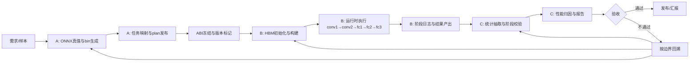

# LeNet5 分工边界管理版（1页）

## A/B/C 一页总表

| 角色 | 负责层级 | 核心目标 | 关键交付 | 验收口径（管理视角） |
|---|---|---|---|---|
| A（模型与后端） | 应用/模型层 + 算子编译后端 | 让输入与权重真值可追溯、可复现 | ONNX 主线权重、同名 bin、`lenet_plan_v2.json` | 同一输入重复生成结果一致；bin/plan 完整；与 ONNX 语义一致 |
| B（编排与运行时） | 编排层 + 执行运行时层 | 让流程稳定跑通并可定位问题 | 一键执行链路、阶段里程碑日志、失败可定位日志 | 端到端可运行；阶段顺序正确；失败可定位到具体阶段 |
| C（平台与观测） | 平台建模层 + 观测分析层 | 让性能数据可信、可解释 | 平台参数快照、阶段延迟 CSV、瓶颈分析结论 | 统计口径稳定；阶段完整性检查通过；结论可复现实验 |

> 管理原则：A 定义真值与契约，B 保证执行与交付，C 保证可观测与可解释。

---

## 一页流程图（从需求到结论）

---

## 升级与变更控制（3条）

- 先冻结 ABI 再联调：无 `plan/bin/layout` 版本号，不进入 B/C 阶段。
- 先功能后性能：B 先确保跑通与可定位，C 再做性能优化和归因。
- 问题回溯按边界：先查 A（真值/契约），再查 B（执行/同步），最后查 C（口径/模型）。
